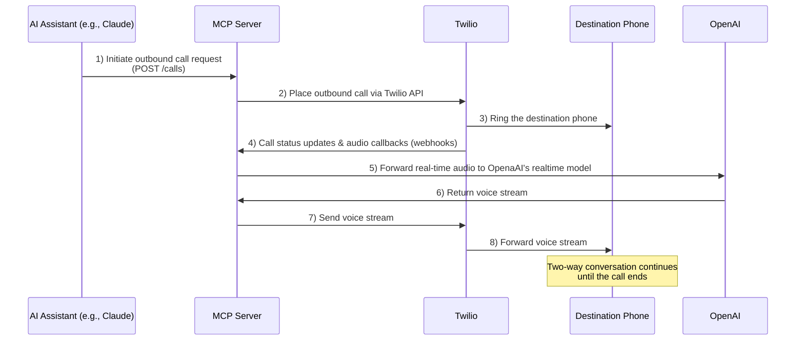

# Voice Call & SMS MCP Server

A Model Context Protocol (MCP) server that enables Claude and other AI assistants to initiate and manage voice calls and SMS messages using Twilio with support for multiple AI voice providers (OpenAI GPT-4o Realtime and ElevenLabs Conversational AI).

Use this as a base to kick-start your AI-powered voice calling and SMS messaging explorations, save time and develop additional functionality on top of it.


## Sequence Diagram




## Features

- Make outbound phone calls via Twilio 📞
- **NEW:** Support for multiple AI voice providers:
  - OpenAI GPT-4o Realtime model (advanced conversational capabilities) 🤖
  - ElevenLabs Conversational AI (natural-sounding voices) 🎭
- **NEW:** Send and receive SMS messages via Twilio 💬
- Server-Sent Events (SSE) for real-time call updates, transcriptions, and SMS notifications 📡
- Store and retrieve SMS conversation history 📱
- Real-time language switching during calls (OpenAI) 🌐
- Pre-built prompts for common calling scenarios (like restaurant reservations) 🍽️
- Automatic public URL tunneling with ngrok 🔄
- Secure handling of credentials 🔒

## Why MCP?

The Model Context Protocol (MCP) bridges the gap between AI assistants and real-world actions. By implementing MCP, this server allows AI models like Claude to:

1. Initiate actual phone calls on behalf of users
2. Process and respond to real-time audio conversations
3. Execute complex tasks requiring voice communication

This open-source implementation provides transparency and customizability, allowing developers to extend functionality while maintaining control over their data and privacy.

## Requirements

- Node.js >= 22
  - If you need to update Node.js, we recommend using `nvm` (Node Version Manager):
    ```bash
    nvm install 22
    nvm use 22
    ```
- Twilio account with API credentials
- OpenAI API key
- Ngrok Authtoken

## Installation

### Manual Installation

1. Clone the repository
   ```bash
   git clone https://github.com/lukaskai/voice-call-mcp-server.git
   cd voice-call-mcp-server
   ```

2. Install dependencies and build
   ```bash
   npm install
   npm run build
   ```

## Configuration

The server requires several environment variables:

- `TWILIO_ACCOUNT_SID`: Your Twilio account SID
- `TWILIO_AUTH_TOKEN`: Your Twilio auth token
- `TWILIO_NUMBER`: Your Twilio number
- `OPENAI_API_KEY`: Your OpenAI API key (required for OpenAI voice provider)
- `ELEVENLABS_API_KEY`: Your ElevenLabs API key (optional - for ElevenLabs voice provider)
- `ELEVENLABS_AGENT_ID`: Your ElevenLabs agent ID (optional - for ElevenLabs voice provider)
- `NGROK_AUTHTOKEN`: Your ngrok authtoken
- `RECORD_CALLS`: Set to "true" to record calls (optional)

### Claude Desktop Configuration

To use this server with Claude Desktop, add the following to your configuration file:

**macOS**: `~/Library/Application Support/Claude/claude_desktop_config.json`

**Windows**: `%APPDATA%\Claude\claude_desktop_config.json`

```json
{
  "mcpServers": {
    "voice-call": {
      "command": "node",
      "args": ["/path/to/your/mcp-new/dist/start-all.cjs"],
      "env": {
        "TWILIO_ACCOUNT_SID": "your_account_sid",
        "TWILIO_AUTH_TOKEN": "your_auth_token",
        "TWILIO_NUMBER": "your_e.164_format_number",
        "OPENAI_API_KEY": "your_openai_api_key",
        "NGROK_AUTHTOKEN": "your_ngrok_authtoken"
      }
    }
  }
}
```

After that, restart Claude Desktop to reload the configuration. 
If connected, you should see Voice Call under the 🔨 menu.

## Example Interactions with Claude

Here are some natural ways to interact with the server through Claude:

### Voice Calls

#### Using OpenAI (default):
1. Simple call:
```
Can you call +1-123-456-7890 and let them know I'll be 15 minutes late for our meeting?
```

2. Restaurant reservation:
```
Please call Delicious Restaurant at +1-123-456-7890 and make a reservation for 4 people tonight at 7:30 PM. Please speak in German.
```

3. Appointment scheduling:
```
Please call Expert Dental NYC (+1-123-456-7899) and reschedule my Monday appointment to next Friday between 4–6pm.
```

#### Using ElevenLabs:
1. Call with natural voice:
```
Using ElevenLabs, call +1-123-456-7890 and confirm the delivery address for order #12345.
```

2. Customer service call:
```
Use ElevenLabs voice to call +1-123-456-7890 and inquire about the warranty status for my laptop serial number ABC123.
```

Note: When using ElevenLabs, the AI agent's behavior is pre-configured in your ElevenLabs agent settings.

### SMS Messages

1. Send a simple SMS:
```
Send a text message to +1-123-456-7890 saying "Running 10 minutes late, see you soon!"
```

2. Get SMS conversation history:
```
Show me my SMS conversation with +1-123-456-7890
```

3. List all SMS conversations:
```
Show me all my recent SMS conversations
```

## Server-Sent Events (SSE) Support

The server now includes real-time Server-Sent Events support for monitoring call progress, receiving live transcriptions, and SMS notifications.

### SSE Endpoints

#### Voice Calls
When you initiate a call, the response includes an `sseUrl` that you can connect to for real-time updates:

```json
{
  "status": "success",
  "message": "Call triggered successfully",
  "callSid": "CA1234567890abcdef",
  "sseUrl": "https://your-ngrok-url.ngrok.io/events?callSid=CA1234567890abcdef"
}
```

#### SMS Messages
When you send an SMS, the response includes an `sseUrl` for real-time SMS updates:

```json
{
  "status": "success",
  "message": "SMS sent successfully",
  "messageSid": "SM1234567890abcdef",
  "conversationId": "uuid-here",
  "sseUrl": "https://your-ngrok-url.ngrok.io/sms/events?conversationId=uuid-here"
}
```

### Event Types

#### Voice Call Events
- **`connected`** - Confirms SSE connection established
- **`call-status`** - Call status updates (initiated, connected, ended)
- **`transcription`** - Real-time transcriptions from both AI and human speakers
- **`call-ended`** - Call termination with duration info
- **`error`** - Error events during the call
- **`heartbeat`** - Periodic keepalive events

#### SMS Events
- **`sms-sent`** - Outbound SMS message sent
- **`sms-received`** - Inbound SMS message received
- **`sms-update`** - SMS conversation updated
- **`heartbeat`** - Periodic keepalive events

### Example SSE Client

```javascript
const eventSource = new EventSource(sseUrl);

eventSource.addEventListener('transcription', (event) => {
  const data = JSON.parse(event.data);
  console.log(`${data.speaker}: ${data.transcription}`);
});

eventSource.addEventListener('call-status', (event) => {
  const data = JSON.parse(event.data);
  console.log(`Call status: ${data.status}`);
});
```

## Voice Provider Comparison

### OpenAI GPT-4o Realtime
- **Pros**: Advanced conversational capabilities, context-aware responses, real-time language switching
- **Cons**: Can sound robotic, higher latency, more expensive
- **Best for**: Complex conversations, multi-language support, dynamic prompts

### ElevenLabs Conversational AI
- **Pros**: Natural-sounding voices, lower latency, pre-configured agents
- **Cons**: Less flexible, requires agent setup, no dynamic prompt changes
- **Best for**: Customer service, simple interactions, when voice quality is priority

## Important Notes

1. **Phone Number Format**: All phone numbers must be in E.164 format (e.g., +11234567890)
2. **Rate Limits**: Be aware of your Twilio, OpenAI, and ElevenLabs account rate limits and pricing
3. **Voice Conversations**: The AI will handle natural conversations in real-time
4. **Call Duration**: Be mindful of call durations as they affect API costs
5. **Public Exposure**: Be aware that the ngrok tunnel exposes your server publicly for Twilio to reach it (though with a random URL and protected by a random secret)
6. **SMS Webhook Configuration**: To receive incoming SMS messages, configure your Twilio phone number webhook to point to `https://your-ngrok-url.ngrok.io/sms/webhook`
7. **ElevenLabs Agent Setup**: For ElevenLabs, you must pre-configure your agent in the ElevenLabs dashboard before using it

## Troubleshooting

Common error messages and solutions:

1. "Phone number must be in E.164 format"
   - Make sure the phone number starts with "+" and the country code

2. "Invalid credentials"
   - Double-check your TWILIO_ACCOUNT_SID and TWILIO_AUTH_TOKEN. You can copy them from the [Twilio Console](https://console.twilio.com)

3. "OpenAI API error"
   - Verify your OPENAI_API_KEY is correct and has sufficient credits

4. "Ngrok tunnel failed to start"
   - Ensure your NGROK_AUTHTOKEN is valid and not expired

5. "OpenAI Realtime does not detect the end of voice input, or is lagging."
   - Sometimes, there might be voice encoding issues between Twilio and the receiver's network operator. Try using a different receiver.

6. "ElevenLabs API error"
   - Verify your ELEVENLABS_API_KEY and ELEVENLABS_AGENT_ID are correct
   - Ensure your ElevenLabs agent is properly configured and published
   - Check that your ElevenLabs account has sufficient credits

## Contributing

Contributions are welcome! Here are some areas we're looking to improve:

- Implement support for multiple AI models beyond the current implementation
- Add database integration to store conversation history locally and make it accessible for AI context
- Improve latency and response times to enhance call experiences
- Enhance error handling and recovery mechanisms
- Add more pre-built conversation templates for common scenarios
- Implement improved call monitoring and analytics

If you'd like to contribute, please open an issue to discuss your ideas before submitting a pull request.

## License

This project is licensed under the MIT License - see the LICENSE file for details.

## Security

Please do not include any sensitive information (like phone numbers or API credentials) in GitHub issues or pull requests. This server handles sensitive communications; deploy it responsibly and ensure all credentials are kept secure.


## Time For a New Mission?

We’re hiring engineers to build at the frontier of voice AI — and bake it into a next-gen telco.

Curious? Head to [careers.popcorn.space](https://careers.popcorn.space/apply) 🍿 !
